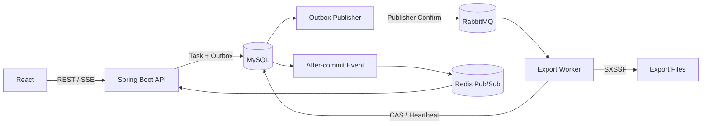

# Export Flow

基于 Spring Boot 和 React 的异步订单导出系统。任务通过 RabbitMQ 异步执行，使用 Apache POI SXSSF 流式生成 `.xlsx`，并通过 SSE 向前端同步状态和进度。

## 功能概览

- 按筛选条件导出或跨分页选择订单导出
- 支持 20/50/100 分页、5,000 条选择上限和 1,000,000 条条件导出上限
- 使用 `Idempotency-Key` 保证任务创建和手动重试的幂等性
- 任务按 Task、Run、Attempt 三层记录执行状态和历史
- 自动重试、手动重试、Worker 失联恢复和执行令牌 fencing
- 实时进度、SSE 断线重连及 REST 定期对账
- 文件下载统计、缺失检测、24 小时过期和孤儿文件清理
- 统一 API 响应、请求 ID 及跨消息链路日志追踪

## 架构



MySQL 是任务状态的事实源。Task、Run 和 Attempt 在同一事务中更新；Outbox 与任务数据一同提交。SSE 事件在事务提交后发布并携带数据库版本，前端据此处理乱序事件，同时保留低频 REST 校准。

## 技术栈

- Java 21、Spring Boot 3.5.16、MyBatis 3.0.5、Flyway、Apache POI 5.5.1
- MySQL 8.4、RabbitMQ 4.2、Redis 8.2
- React 19、TypeScript 7、Vite 8、Ant Design 6、TanStack Query 5、Vitest 4

## Docker Compose 启动

需要 Docker Desktop，并确保 `3306`、`5672`、`6379`、`8080`、`5173` 端口可用。

```powershell
Copy-Item .env.example .env
docker compose up -d --build
docker compose ps
```

服务地址：

- Web：<http://localhost:5173>
- API 健康检查：<http://localhost:8080/actuator/health>
- Swagger UI：<http://localhost:8080/swagger-ui.html>
- RabbitMQ 管理台：<http://localhost:15672>

RabbitMQ 默认用户名和密码均为 `export_flow`。`dev` Profile 默认生成 100,000 条订单；可在 `.env` 中调整 `APP_SEED_ORDERS`。

停止服务：

```powershell
docker compose down
```

## 本地开发

先启动基础设施：

```powershell
docker compose up -d mysql rabbitmq redis
```

启动后端：

```powershell
Set-Location backend
mvn spring-boot:run -Dspring-boot.run.profiles=dev
```

启动前端：

```powershell
Set-Location frontend
pnpm.cmd install
$env:VITE_API_TARGET='http://localhost:8080'
pnpm.cmd dev
```

后端也可以从 IDE 运行 `com.example.exportflow.ExportFlowApplication`，Program arguments 使用：

```text
--spring.profiles.active=dev --app.seed.orders=100000
```

## 验证

```powershell
# 后端
Set-Location backend
mvn test

# 前端
Set-Location ../frontend
pnpm.cmd lint
pnpm.cmd test --run
pnpm.cmd build

# Compose
Set-Location ..
docker compose config --quiet
```

## 目录

```text
backend/                  Spring Boot API、消息消费和调度任务
frontend/                 React Web 应用
docs/PRD.md               产品需求与状态机
docs/API.md               REST、SSE 和错误码
docs/DEMO.md              演示与故障注入
docs/TESTING.md           测试与验收说明
data/exports/             运行时导出文件
compose.yaml              本地服务编排
```

更多接口和状态说明见 [API 文档](docs/API.md) 与 [产品文档](docs/PRD.md)。
