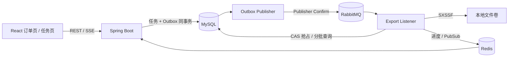

# Export Flow

一个以学习为目标、可本地运行的异步订单导出项目。前端使用 React，后端使用 Spring Boot；创建任务后由 Transactional Outbox 保证消息最终投递，RabbitMQ 消费者使用数据库状态机抢占任务，Apache POI SXSSF 流式生成 `.xlsx`，任务页通过 SSE 展示真实进度，并在 SSE 连续失败后降级为 REST 轮询。

## 已实现能力

- 订单页支持 9 组筛选条件、20/50/100 分页、跨分页勾选和 5,000 条选择上限。
- 支持“导出已选”和“按条件导出”；条件任务创建时同步统计，最长等待 5 秒，最多 1,000,000 条。
- `Idempotency-Key`：相同 Key + 相同请求返回原任务；相同 Key + 不同请求返回 409；不同 Key 可创建新任务。
- MySQL 保存任务真相，Outbox 与任务同事务写入；RabbitMQ 使用主队列、延迟重试队列和死信队列。
- 一个逻辑任务包含多个 Run：每个 Run 自动执行最多 3 次；最终失败后可在同一任务下手动发起新 Run，最多 2 次。
- 数据库 CAS + `executionToken` 防止重复消费和旧 Worker 覆盖新结果，不依赖 Redis 分布式锁。
- 真实进度、Run/Attempt 分层历史、心跳失联恢复、文件下载次数、24 小时过期清理。
- SSE + Redis Pub/Sub 实时推送；连续 3 次连接失败后每 2 秒轮询，并每 5 秒尝试恢复 SSE。
- 业务 JSON 统一使用 `code/message/data/requestId/timestamp` 响应信封；SSE、Excel 下载、Actuator 和 Swagger 保持标准协议。
- 单 Sheet `.xlsx`、14 列、公式注入防护、SXSSF 流式写入；已实测导出 100 万行。

## 架构



项目刻意不使用 XXL-JOB：当前恢复、Outbox 发布和文件清理由 Spring `@Scheduled` 完成，更适合单体学习项目。以后扩展成多服务、多实例调度中心时，再引入 XXL-JOB 会更有学习价值。

## 技术栈

- Java 21、Spring Boot 3.5.16、MyBatis 3.0.5、Flyway、Apache POI 5.5.1
- MySQL 8.4、RabbitMQ 4.2、Redis 8.2
- React 19、TypeScript 7、Vite 8、Ant Design 6、TanStack Query 5、Vitest 4

## 最快启动：Docker Compose

前置条件：Docker Desktop 可用，端口 `3306`、`5672`、`6379`、`8080`、`5173` 未被占用。

```powershell
Copy-Item .env.example .env
docker compose up -d --build
docker compose ps
```

访问：

- 前端：`http://localhost:5173`
- 后端健康检查：`http://localhost:8080/actuator/health`
- Swagger UI：`http://localhost:8080/swagger-ui.html`
- RabbitMQ 管理台：`http://localhost:15672`，默认账号/密码均为 `export_flow`

Compose 默认用 `dev` Profile 生成 100,000 条订单。修改 `.env` 中的 `APP_SEED_ORDERS=1000000` 可补齐到 100 万条；生成器只追加缺少的数据，不会删除已有订单。

## 用 IDEA 启动后端

你的 IntelliJ IDEA 自带 JBR 可以启动本项目；项目编译目标仍固定为 Java 21。推荐操作：

1. 先只启动中间件：

   ```powershell
   docker compose up -d mysql rabbitmq redis
   ```

2. 在 IDEA 中打开 `backend/pom.xml`，等待 Maven 导入完成。
3. Run Configuration 选择 `com.example.exportflow.ExportFlowApplication`。
4. Program arguments 填入：

   ```text
   --spring.profiles.active=dev --app.seed.orders=100000
   ```

5. 如果 8080 已被占用，再加 `--server.port=18080`。

Flyway 会自动创建五张核心表；`dev` Profile 会按参数分批补充订单。默认数据库、RabbitMQ、Redis 都连接 `localhost`。

## 本地启动前端

```powershell
Set-Location frontend
pnpm.cmd install
$env:VITE_API_TARGET='http://localhost:8080'
pnpm.cmd dev
```

如果 IDEA 后端改为 18080，把 `VITE_API_TARGET` 同步改为 `http://localhost:18080`。若 5173 被占用，Vite 会自动选择下一个端口。

## 常用开发命令

```powershell
# 后端（JDK 21+）
Set-Location backend
mvn test
mvn spring-boot:run -Dspring-boot.run.profiles=dev

# 前端
Set-Location frontend
pnpm.cmd lint
pnpm.cmd test --run
pnpm.cmd build
```

## 目录

```text
backend/                  Spring Boot API、MQ Consumer、调度器
frontend/                 React 两页面应用
docs/PRD.md               完整产品需求
docs/API.md               REST、SSE 与错误说明
docs/DEMO.md              学习与故障演示脚本
docs/TESTING.md           测试命令和本机实测结果
data/exports/             运行时导出文件（已被 Git 忽略）
compose.yaml              完整本地环境
```

## 常见问题

- Docker Hub 出现 `failed to fetch oauth token`：这是镜像仓库网络或 IPv6 连接问题，重试 `docker compose up -d --build`，或先用 Compose 启动三个中间件、再从 IDEA 启动后端。
- RabbitMQ 报 `.erlang.cookie: eacces`：当前 Compose 已显式设置 `RABBITMQ_ERLANG_COOKIE`。若数据卷是旧版本创建的，可修正该卷所有者后重启 RabbitMQ。
- 8080/5173 被占用：分别使用 `--server.port=18080` 和 Vite 自动端口，并设置 `VITE_API_TARGET`。
- 前端显示“轮询降级”：SSE 连续 3 次连接失败后的正常降级，每 5 秒自动尝试恢复，任务数据仍以 MySQL REST 查询为准。
- 文件不可下载：只有 `SUCCESS` 且未过 24 小时的任务允许下载；文件丢失或过期会返回明确错误码。

详细决策、范围和状态机见 [PRD](docs/PRD.md)。
