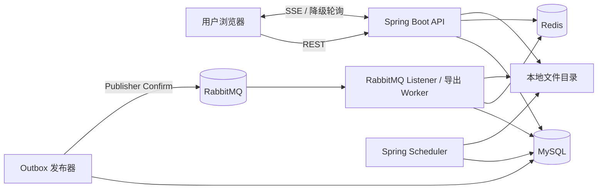
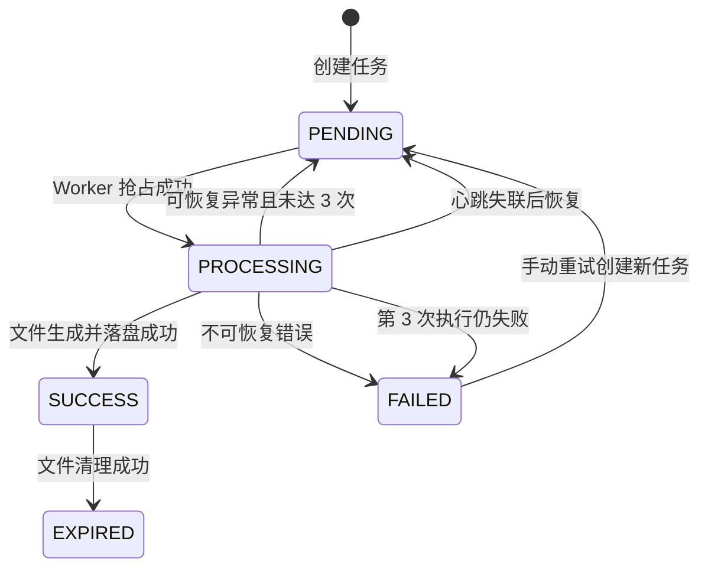
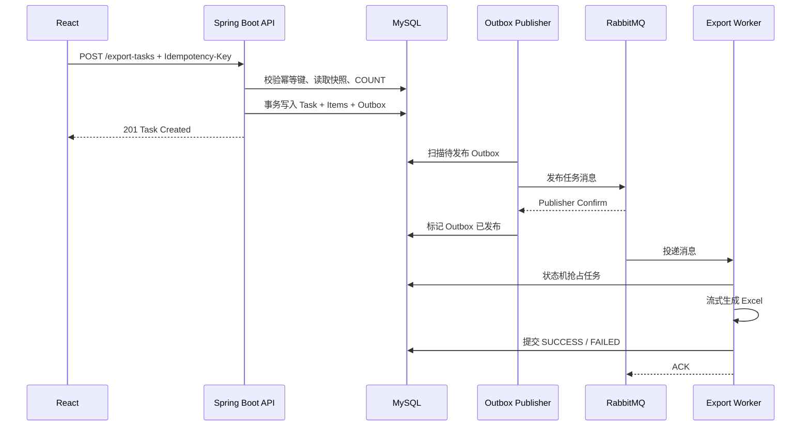
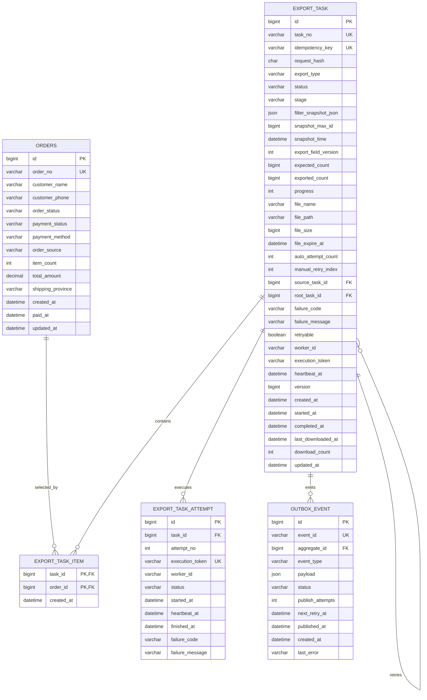

# 异步订单导出系统 PRD

## 1. 文档信息

| 项目 | 内容 |
| --- | --- |
| 项目名称 | Export Flow 异步订单导出系统 |
| 文档类型 | 产品需求文档（PRD） |
| 版本 | v1.0 |
| 状态 | 已确认，待实现 |
| 面向版本 | 学习型 MVP |
| 前端 | React + TypeScript |
| 后端 | Spring Boot + MyBatis |
| 基础设施 | MySQL + RabbitMQ + Redis + 本地磁盘 |
| 文档日期 | 2026-08-21 |

## 2. 项目背景

传统同步导出通常在一次 HTTP 请求中完成数据查询、文件生成和响应传输。当数据量较大时，会带来以下问题：

- 请求持续时间长，容易触发浏览器、网关或服务端超时；
- 导出线程长期占用，影响普通查询请求；
- 大量数据一次性加载到内存可能导致 JVM OOM；
- 用户无法获知任务进度，失败后也缺少可靠的重试入口；
- 服务重启或进程异常退出后，执行中的任务难以恢复；
- 数据库任务记录与 MQ 消息之间可能出现一致性问题。

本项目通过“创建导出任务—MQ 异步消费—流式生成 Excel—任务页查看进度与下载”的方式解决上述问题，并重点实践 Outbox、消息幂等、状态机、心跳恢复、SSE 与降级轮询等机制。

## 3. 产品目标

### 3.1 核心目标

1. 用户能够从订单页跨分页选择订单并创建导出任务。
2. 用户能够按不少于 7 个筛选维度导出全部匹配订单。
3. 创建任务时同步校验预计数量，但不在 HTTP 请求中生成 Excel。
4. 后端通过 RabbitMQ 异步执行导出，HTTP 请求线程不参与文件生成。
5. 用户能够在任务页实时查看真实进度、处理阶段和结果。
6. 成功任务可在 24 小时内下载，过期文件自动清理。
7. 可重试的失败任务支持最多 2 次手动重试。
8. Worker 异常退出后，系统能够识别失联任务并从头自动执行。
9. 通过 Transactional Outbox 保证任务记录与待发送消息的一致性。
10. 单任务能够以稳定内存占用完成最多 100 万条订单的 `.xlsx` 导出。

### 3.2 成功标准

- 创建任务接口不等待 Excel 生成；
- 同步数量统计最多等待 5 秒，超时不创建任务；
- 10 万条数据用于日常开发，100 万条数据用于性能演示；
- 100 万条导出过程中 JVM 内存不随总行数线性增长且不发生 OOM；
- SSE 正常时，用户通常在 2 秒内看到进度变化；
- SSE 或 Redis 异常时，导出不因此失败，前端可使用轮询查看 MySQL 中的阶段性进度；
- MQ 重复投递不会产生两个有效结果文件；
- 应用执行中异常退出并重新启动后，失联任务可被重新执行；
- 相同幂等键的网络重试不会重复创建任务。

## 4. 非目标

MVP 不包含以下能力：

- 用户登录、租户隔离和 RBAC；
- 订单创建、编辑、删除和状态变更；
- 取消或删除导出任务；
- 过期任务一键重新生成；
- 相同筛选条件的业务级任务去重；
- 用户自定义导出列、导出顺序或 Excel 样式；
- 多 Sheet、多文件或 ZIP 分片；
- CSV 导出；
- MinIO、云对象存储或 CDN；
- API 与 Worker 分进程部署；
- XXL-JOB；
- Redis 分布式锁；
- MQ、吞吐量和消费者指标看板；
- 页面化死信处理与人工重新投递；
- Excel 断点续写；
- 开发环境故障注入开关；
- 单独的“学习要点”文档。

## 5. 用户与核心场景

MVP 不做登录，所有访问者共享订单和任务数据，只有一个逻辑用户角色。

### 5.1 场景一：导出已选订单

1. 用户在订单页筛选和浏览订单；
2. 用户在多个分页中勾选订单；
3. 页面持续展示已选择数量；
4. 用户点击“导出已选订单”；
5. 后端校验订单数量和幂等键，创建任务并写入订单 ID 快照；
6. 页面提示任务创建成功并提供“查看任务”；
7. 用户可继续停留在订单页。

### 5.2 场景二：按条件导出

1. 用户填写一个或多个筛选条件；
2. 用户点击“按当前条件导出”；
3. 前端请求预计数量并展示确认信息；
4. 用户确认后，后端在创建任务时再次执行权威数量校验；
5. 数量合法时创建任务，否则立即提示无数据、超限或统计超时；
6. Worker 按条件快照异步生成 Excel。

### 5.3 场景三：查看和下载

1. 用户进入任务页；
2. 页面先通过 REST 加载任务，再建立 SSE 连接；
3. 任务进度和阶段实时更新；
4. 任务成功后出现“下载”按钮；
5. 用户在文件过期前通过后端接口下载。

### 5.4 场景四：失败与重试

1. Worker 遇到可恢复异常；
2. 系统自动重新执行，单个任务总共最多执行 3 次；
3. 三次均失败后，任务进入 `FAILED`；
4. 用户在任务页手动重试；
5. 系统创建一个关联的新任务并复用原快照；
6. 一条根任务链最多进行 2 次手动重试。

## 6. 总体架构

项目采用前后端分离、后端单体部署。RabbitMQ Listener 使用独立线程池，不占用 HTTP 请求线程；但 HTTP、MQ 消费和调度任务仍共享同一 JVM 与主机资源。



### 6.1 技术栈

| 层级 | 技术 |
| --- | --- |
| 前端框架 | React、TypeScript、Vite |
| UI | Ant Design |
| 数据请求 | TanStack Query |
| 路由 | React Router |
| 后端 | Java 21、Spring Boot 3.x |
| 数据访问 | MyBatis |
| 数据库 | MySQL |
| 消息队列 | RabbitMQ |
| 缓存与事件 | Redis、Redis Pub/Sub |
| Excel | Apache POI SXSSF |
| 数据迁移 | Flyway |
| 构建 | Maven |
| 本地部署 | Docker Compose |
| 调度 | Spring `@Scheduled` |

## 7. 订单领域

### 7.1 订单字段

| 字段 | 类型/示例 | 说明 |
| --- | --- | --- |
| 订单 ID | Long | 数据库主键 |
| 订单号 | `ORD202608210001` | 唯一业务编号 |
| 客户姓名 | 张三 | 支持模糊查询 |
| 客户手机号 | `13800138000` | 支持精确查询 |
| 订单状态 | 待付款、待发货、已发货、已完成、已关闭 | 多选筛选 |
| 支付状态 | 未支付、已支付、已退款 | 多选筛选 |
| 支付方式 | 支付宝、微信、银行卡 | 多选筛选 |
| 订单来源 | Web、App、小程序 | 多选筛选 |
| 商品数量 | 正整数 | 导出字段 |
| 订单金额 | Decimal | 支持金额区间 |
| 收货省份 | 省级名称 | 导出字段 |
| 创建时间 | DateTime | 支持时间区间 |
| 支付时间 | DateTime，可空 | 导出字段 |
| 更新时间 | DateTime | 导出字段 |

订单在 MVP 中只读，不提供物理删除。模拟数据允许通过开发工具重新生成，不属于产品页面能力。

枚举代码统一由后端定义，前端只使用代码提交、使用中文名称展示：

| 枚举 | 代码与中文名称 |
| --- | --- |
| 订单状态 | `PENDING_PAYMENT` 待付款、`PENDING_SHIPMENT` 待发货、`SHIPPED` 已发货、`COMPLETED` 已完成、`CLOSED` 已关闭 |
| 支付状态 | `UNPAID` 未支付、`PAID` 已支付、`REFUNDED` 已退款 |
| 支付方式 | `ALIPAY` 支付宝、`WECHAT` 微信、`BANK_CARD` 银行卡 |
| 订单来源 | `WEB` Web、`APP` App、`MINI_PROGRAM` 小程序 |

### 7.2 筛选条件

订单页提供以下 9 组筛选条件：

1. 订单号：精确查询；
2. 客户姓名：包含式模糊查询；
3. 客户手机号：精确查询；
4. 订单状态：多选；
5. 支付状态：多选；
6. 支付方式：多选；
7. 订单来源：多选；
8. 订单金额：最小金额与最大金额；
9. 下单时间：开始时间与结束时间。

校验规则：

- 最小金额不得小于 0；
- 最大金额不得小于最小金额；
- 结束时间不得早于开始时间；
- 多选值必须属于后端枚举；
- 订单号和手机号去除首尾空格后查询；
- 客户姓名限制合理长度并转义 SQL 通配符；
- 所有筛选同时存在时采用 AND 组合，同一多选条件内部采用 IN。

### 7.3 订单列表

- 默认按创建时间倒序；
- 支持每页 20、50、100 条；
- 不提供自定义排序；
- 列表展示核心字段，字段过多时允许横向滚动；
- 查询、重置和分页变化均通过后端分页接口执行；
- 筛选条件变化后页码重置为第 1 页。

## 8. 订单页需求

### 8.1 页面区域

1. 筛选区：默认展示常用条件，支持展开高级条件；
2. 操作区：查询、重置、导出已选、按条件导出；
3. 已选择提示区：展示已选数量和“清空选择”；
4. 订单表格：分页、复选框和订单字段；
5. 导出确认弹窗；
6. 创建结果提示。

### 8.2 跨分页选择

- 表头复选框只影响当前页；
- 翻页后保留其他页面的已选订单 ID；
- 已选择数量实时展示；
- 最多选择 5,000 条；
- 达到上限后禁止继续勾选，并提示使用条件导出；
- 修改任意筛选条件时，如果已有选择，先提示“修改筛选条件将清空已选订单”；
- 用户确认后清空选择并执行新查询，取消则保留当前条件与选择；
- 刷新浏览器后清空选择，不使用本地持久化；
- 分页和每页条数变化不清空选择；
- 已选订单创建任务成功后清空选择，创建失败时保留选择。

### 8.3 导出已选订单

- 未选择订单时按钮禁用；
- 确认弹窗展示已选数量；
- 前端为本次操作生成 `Idempotency-Key`；
- 后端验证 ID 数量不超过 5,000，并查询有效订单数；
- 不存在的订单跳过；若有效订单数为 0，则不创建任务；
- 有效订单 ID 批量写入 `export_task_item`；
- 创建成功后展示任务编号和“查看任务”按钮；
- 用户保持在订单页，不自动跳转。

### 8.4 按条件导出

- 有筛选条件时，确认弹窗展示条件摘要和预计数量；
- 没有任何筛选条件时，必须二次确认“将导出全部订单”；
- 前端可先调用数量预览接口；预览结果只用于界面展示；
- 用户确认创建时，后端重新执行权威数量统计；
- 后端创建任务时读取 `snapshot_max_id`，统计条件必须包含 `id <= snapshot_max_id`；
- 统计为 0、超过 100 万或超过 5 秒时，不创建任务并返回明确错误；
- 创建成功后保留当前筛选条件。

### 8.5 防重复点击

- 用户点击确认后，按钮进入加载状态；
- 同一次操作在收到明确响应前不得生成新的幂等键；
- 网络错误重试必须复用本次操作的幂等键；
- 用户明确发起一次新的导出操作时生成新键。

## 9. 导出任务创建

### 9.1 条件导出创建事务

1. 校验请求头、筛选格式和枚举；
2. 规范化请求并计算 `request_hash`；
3. 处理幂等键；
4. 读取当前最大订单 ID；
5. 使用相同筛选条件与最大 ID 执行 `COUNT(*)`；
6. 校验 0 条、100 万上限和 5 秒超时；
7. 在一个数据库事务内插入 `export_task` 和 `outbox_event`；
8. 提交事务后返回任务信息。

### 9.2 勾选导出创建事务

1. 校验请求头、ID 格式、非空与 5,000 条上限；
2. 对 ID 排序、去重并计算 `request_hash`；
3. 处理幂等键；
4. 查询实际存在的订单 ID，不存在的 ID 跳过；
5. 在一个事务内插入 `export_task`、批量插入 `export_task_item`、插入 `outbox_event`；
6. 返回任务信息。

### 9.3 请求幂等

前端通过请求头传递：

```http
Idempotency-Key: <UUID>
```

规则：

- 首次出现的 Key：正常处理；
- 相同 Key、相同规范化请求内容：返回原任务，不重复创建；
- 相同 Key、不同请求内容：返回 HTTP 409，错误码 `IDEMPOTENCY_KEY_REUSED`；
- 不同 Key：即使请求内容和筛选条件完全相同，也创建新任务；
- 系统不计算业务条件指纹，不合并不同 Key 创建的任务；
- `export_task.idempotency_key` 建立唯一约束；
- `request_hash` 使用规范化请求的 SHA-256；
- 手动重试接口也必须携带独立的幂等键。

并发提交相同 Key 时，以数据库唯一约束作为最终防线。未插入成功的请求重新读取已存在记录并比较 `request_hash`，不得仅依赖 JVM 内存锁。

首次创建成功返回 HTTP 201；相同 Key 的重复请求返回 HTTP 200，并在响应中标记 `idempotentReplay=true`。

### 9.4 同步统计

- 数量统计属于任务创建流程，不属于 Worker；
- 单次统计最长允许 5 秒；
- 超时后取消查询，不写入任务和 Outbox；
- 预览统计与创建统计均使用相同的筛选构造器；
- 客户姓名包含式查询可能无法有效使用普通索引，此限制需要在运行文档中说明；
- 常用枚举、时间、金额和手机号字段应建立适当索引。

## 10. 快照语义

### 10.1 勾选快照

- 创建任务时保存实际存在的订单 ID；
- `export_task_item` 是任务的固定成员集合；
- Worker 执行时按这些 ID 读取订单当前字段值；
- 订单 ID 后续不存在时跳过，不导致任务失败；
- 手动重试创建新任务时复制原始任务的订单 ID 快照，确保新任务自包含。

### 10.2 条件快照

任务保存：

- 规范化筛选条件 JSON；
- `snapshot_time`；
- `snapshot_max_id`；
- 预计数量 `expected_count`；
- 导出字段版本。

Worker 查询必须包含 `id <= snapshot_max_id`，因此不会包含任务创建后新增的订单。已有订单字段发生变化时，最终文件可能包含变化后的字段值，这属于 MVP 接受的“逻辑快照”。

### 10.3 数量变化

- `expected_count` 表示创建时统计数量；
- `exported_count` 表示实际写入 Excel 的数量；
- 因已有订单字段变化或订单缺失，两者可以不一致；
- 数量不一致不导致任务失败；
- 任务详情同时展示预计数量和实际数量。

## 11. Excel 生成规则

### 11.1 文件结构

- 文件类型：`.xlsx`；
- 每个任务一个文件；
- 每个文件一个 `订单数据` Sheet；
- 不生成导出说明 Sheet；
- 最大导出 100 万条订单；
- 暂不拆分 Sheet 或文件。

### 11.2 导出列

| 顺序 | 列名 | 格式 |
| --- | --- | --- |
| 1 | 序号 | 从 1 开始 |
| 2 | 订单号 | 文本 |
| 3 | 客户姓名 | 文本 |
| 4 | 客户手机号 | 完整文本值 |
| 5 | 订单状态 | 中文名称 |
| 6 | 支付状态 | 中文名称 |
| 7 | 支付方式 | 中文名称 |
| 8 | 订单来源 | 中文名称 |
| 9 | 商品数量 | 整数 |
| 10 | 订单金额 | 两位小数 |
| 11 | 收货省份 | 文本 |
| 12 | 创建时间 | `yyyy-MM-dd HH:mm:ss` |
| 13 | 支付时间 | 同上，可空 |
| 14 | 更新时间 | 同上 |

### 11.3 查询与写入

- 使用 Apache POI `SXSSFWorkbook`；
- 内存行窗口默认 500，可配置；
- MySQL 每批读取 1,000 条，可配置；
- 使用主键游标分页，不使用大 offset；
- 按订单 ID 升序导出；
- 查询只选择导出需要的字段；
- 每处理一批及时释放中间对象；
- 第一行冻结并开启自动筛选；
- 不加入图片、公式和复杂样式；
- 空值写为空单元格；
- 以 `=`、`+`、`-`、`@` 开头的文本必须进行公式注入转义；
- SXSSF 产生的临时资源必须在 `finally` 中释放。

### 11.4 文件命名

格式：

```text
订单导出_yyyyMMdd_HHmmss_<任务编号>.xlsx
```

文件名由服务端生成并清理非法字符，不接受客户端传入物理文件名或路径。

## 12. 任务状态机

### 12.1 主状态

| 状态 | 含义 | 可执行操作 |
| --- | --- | --- |
| `PENDING` | 等待发布、等待消费或等待自动重试 | 查看详情 |
| `PROCESSING` | 已被 Worker 抢占并执行 | 查看详情 |
| `SUCCESS` | 文件生成成功且未过期 | 查看、下载 |
| `FAILED` | 自动执行已结束且未成功 | 查看；满足条件时手动重试 |
| `EXPIRED` | 文件已过期并完成清理 | 仅查看 |

### 12.2 执行阶段

| 阶段 | 用户文案 |
| --- | --- |
| `QUEUED` | 等待处理 |
| `RETRY_WAITING` | 等待自动重试 |
| `PREPARING` | 正在准备文件 |
| `QUERYING_WRITING` | 正在生成 Excel |
| `FINALIZING` | 正在校验文件 |
| `MOVING` | 正在保存文件 |
| `RECOVERING` | 正在恢复任务 |
| `COMPLETED` | 已完成 |

### 12.3 状态流转



图中 `FAILED --> PENDING` 表示创建一条关联的新任务；原失败任务本身保持 `FAILED`。

### 12.4 进度计算

| 阶段 | 进度区间 |
| --- | --- |
| 等待处理 | 0% |
| 准备文件 | 1%～5% |
| 查询并写入 | 5%～95% |
| 校验与移动 | 95%～99% |
| 成功 | 100% |

写入阶段参考公式：

```text
progress = 5 + floor(exported_count / expected_count * 90)
```

- 写入阶段最高为 95%；
- 当实际数量少于预计数量时，读取结束后允许直接推进到 95%；
- 自动重新执行时，当前任务进度重置为 0，详情中保留旧 Attempt；
- Redis 每写入 1,000 条更新一次；
- MySQL 每 10,000 条或每 5 秒更新一次，以先到条件为准；
- 最终状态和 100% 进度必须先写 MySQL。

## 13. RabbitMQ 与 Outbox

### 13.1 一致性目标

创建任务和创建待发送事件必须位于同一个 MySQL 事务中，避免“任务已创建但 MQ 消息丢失”。

### 13.2 消息流



### 13.3 RabbitMQ 拓扑

- 主交换机：`export.task.exchange`；
- 主队列：`export.task.queue`；
- 重试交换机：`export.retry.exchange`；
- 固定延迟重试队列：`export.retry.queue`；
- 死信交换机：`export.dead.exchange`；
- 死信队列：`export.dead.queue`；
- Consumer 默认并发数为 2，可配置；
- Consumer prefetch 默认 1，避免一个消费者预取多个长任务。

重试队列使用固定 TTL 后死信回主交换机，不依赖 RabbitMQ 延迟消息插件。首版默认延迟 15 秒，并允许通过配置覆盖。

### 13.4 Outbox 发布

- 发布器使用 Spring `@Scheduled`，默认每秒扫描；
- 单批最多处理 100 条；
- 使用 Publisher Confirm；
- Confirm 成功后将事件标为 `PUBLISHED`；
- 发布失败时增加 `publish_attempts`，按退避时间设置 `next_retry_at`；
- 退避上限可配置，事件不因达到某个次数而直接删除；
- 同一事件重复发布是允许的，Consumer 必须幂等；
- Outbox 历史数据的归档或清理不属于 MVP 页面功能。

### 13.5 Consumer ACK 规则

- 抢占失败且任务已被处理或处于终态：ACK；
- 成功完成并持久化状态：ACK；
- 可恢复异常：在数据库事务中记录失败 Attempt、重置任务并写入重试 Outbox，事务成功后 ACK 当前消息；
- 不可恢复异常：持久化 `FAILED` 后 ACK；
- 数据库事务自身失败、无法确认任务状态：NACK 并 requeue；
- 无法解析或不符合协议的消息进入死信队列；
- 死信队列首版只通过 RabbitMQ 管理页面观察。

## 14. 并发、幂等与执行令牌

Worker 通过数据库条件更新抢占任务，不使用 Redis 锁：

```sql
UPDATE export_task
SET status = 'PROCESSING',
    worker_id = #{workerId},
    execution_token = #{executionToken},
    heartbeat_at = NOW(),
    started_at = COALESCE(started_at, NOW()),
    version = version + 1
WHERE id = #{taskId}
  AND status = 'PENDING';
```

- 只有影响行数为 1 的 Worker 可以执行；
- 每次执行使用新的 `execution_token`；
- 所有进度、心跳和终态更新都必须携带当前 token 作为条件；
- 自动恢复会使旧 token 失效；
- 每个 Attempt 使用独立临时文件名，并包含 token；
- Worker 在移动文件和提交成功状态前再次校验 token；
- 旧 Worker 产生的文件不能覆盖新 Worker 文件；
- 数据库 CAS 失败时，Worker 停止执行并清理自己的临时文件；
- 系统定时清理没有被任务记录引用的孤儿临时文件。

## 15. 自动重试与恢复

### 15.1 自动执行次数

- 一个任务总共最多执行 3 次，包含首次执行；
- `export_task.auto_attempt_count` 表示已创建的 Attempt 数；
- 每次执行在 `export_task_attempt` 中保存独立记录；
- 第 1、2 次发生可恢复异常后进入 `PENDING/RETRY_WAITING`；
- 第 3 次仍失败时进入 `FAILED`。

### 15.2 心跳恢复

- Worker 每 10 秒更新一次心跳；
- 恢复调度器每 30 秒扫描一次；
- `PROCESSING` 且超过 60 秒无心跳的任务视为失联；
- 调度器使用数据库条件更新抢占恢复权；
- 旧 Attempt 标记为失联失败；
- 清理旧 Attempt 的临时文件；
- 未达到 3 次时，将任务重置为 `PENDING/RECOVERING` 并写入 Outbox；
- 达到 3 次时进入 `FAILED`；
- 恢复从第 0 行重新生成，不进行 Excel 断点续写；
- 整个应用停止期间无法执行扫描，应用重新启动后恢复调度生效。

### 15.3 错误分类

可自动重试：

- 临时数据库连接或查询异常；
- 短暂文件 I/O 异常；
- Worker 非正常退出；
- 未明确分类但可能恢复的系统异常。

不可自动重试：

- 请求或快照数据格式错误；
- 导出数量为 0 或超过上限；
- 导出目录配置非法；
- 磁盘剩余空间低于配置阈值；
- 不可处理的数据映射错误；
- 文件生成成功后发现结构校验失败且错误明确不可恢复。

错误对用户展示简洁摘要、错误码、是否可手动重试和最后失败时间；Java 堆栈只写服务端日志。

## 16. 手动重试


- 仅 `FAILED`、`retryable=true` 且根任务链手动次数小于 2 时可操作；
- 重试接口必须携带新的 `Idempotency-Key`；
- 重试在事务中创建新任务和新 Outbox 事件；
- 新任务记录直接来源 `source_task_id` 和根任务 `root_task_id`；
- 条件任务复制筛选条件、快照时间、最大 ID、预计数量和字段版本；
- 勾选任务复制 `export_task_item`；
- 新任务拥有独立的最多 3 次自动执行机会；
- 原任务状态与失败信息不被修改；
- 按最新数据导出不属于重试，用户需要回订单页重新创建任务；
- `EXPIRED` 任务不能调用重试接口。

## 17. Redis、SSE 与轮询

### 17.1 Redis 职责

Redis 只用于：

- 高频进度缓存；
- Worker 发布任务变化事件；
- API 订阅事件并转发 SSE；
- 减少任务页高频读取 MySQL。

Redis 不用于：

- 最终状态存储；
- 分布式锁；
- 请求幂等；
- Worker 抢占；
- 自动或手动重试计数。

进度 Key：

```text
export:task:<taskId>:progress
```

事件频道：

```text
export:task:events
```

进度缓存 TTL 为 48 小时；MySQL 始终是最终数据源。

### 17.2 SSE 行为

1. 进入任务页先调用 REST 获取完整第一页；
2. 页面建立一条全局 SSE 连接；
3. 后端推送任务 ID、状态、阶段、进度、预计数、已处理数和更新时间；
4. 服务端每 15 秒发送心跳；
5. 浏览器断线后自动重连；
6. 连续 3 次失败后，前端切换为每 2 秒轮询；
7. 降级期间每 30 秒尝试恢复 SSE；
8. SSE 恢复后停止轮询并重新拉取一次任务列表校准状态；
9. 页面从后台恢复到前台时立即刷新一次。

### 17.3 Redis 故障降级

- Redis 写入失败不终止 Excel 生成；
- Worker 继续按周期写 MySQL 进度；
- Redis Pub/Sub 不可用时，SSE 可能无实时事件；
- 前端检测 SSE 异常后通过 REST 轮询 MySQL 中的进度；
- Redis 恢复后允许 SSE 自然重连；
- MVP 不实现复杂熔断、事件回放和 Redis 状态重建。

## 18. 任务页需求

### 18.1 筛选和列表

筛选条件：

- 任务编号；
- 导出方式；
- 任务状态；
- 创建时间范围。

列表默认按创建时间倒序，展示：

- 任务编号；
- 导出方式；
- 条件摘要或选择数量；
- 状态和阶段；
- 进度条；
- 已处理数/预计数；
- 文件大小；
- 创建、开始、完成时间；
- 自动执行次数；
- 手动重试次数；
- 操作按钮。

新创建任务在列表中置顶并短暂高亮。

### 18.2 操作规则

| 条件 | 下载 | 重试 | 查看详情 |
| --- | --- | --- | --- |
| `PENDING` | 否 | 否 | 是 |
| `PROCESSING` | 否 | 否 | 是 |
| `SUCCESS` 且文件有效 | 是 | 否 | 是 |
| `FAILED` 且可重试、未达上限 | 否 | 是 | 是 |
| `FAILED` 不可重试或达到上限 | 否 | 否，展示原因 | 是 |
| `EXPIRED` | 否 | 否 | 是 |

### 18.3 任务详情

使用抽屉或等价侧边面板展示：

- 基本信息和当前阶段；
- 导出方式；
- 原始筛选条件或已选数量；
- 快照时间和最大订单 ID；
- 预计数量、实际数量；
- 文件名、大小、有效期和下载次数；
- 状态时间线；
- 每次自动执行的编号、Worker、时间、结果和失败摘要；
- 原任务、直接来源任务和后续重试任务链接；
- 失败错误码、摘要、是否可重试；
- 内部英文状态和执行令牌的脱敏短值，便于学习与排查。

## 19. 文件存储、下载与清理

### 19.1 目录

应用配置两个独立目录：

- 临时目录：写入中的文件；
- 正式目录：仅保存成功文件。

文件路径只保存在服务端，不通过 API 返回物理路径。

### 19.2 完成流程

1. Worker 在独立临时文件中写入；
2. 关闭 Workbook 并释放 SXSSF 临时资源；
3. 校验文件存在、非空且可被基本解析；
4. 再次校验 `execution_token`；
5. 以包含 token 的唯一文件名原子移动到正式目录；
6. 通过数据库 CAS 写入文件信息和 `SUCCESS`；
7. CAS 失败时删除本 Worker 移动的孤儿文件；
8. Redis 发布 100% 事件。

### 19.3 下载

- 只允许下载 `SUCCESS` 且未过期的任务；
- 下载通过后端流式接口，不暴露磁盘路径；
- 响应设置正确的 XLSX Content-Type 和 UTF-8 文件名；
- 每次成功开始下载后更新下载次数和最后下载时间；
- 下载不改变任务主状态；
- 文件不存在时返回 `FILE_MISSING`，任务修正为 `FAILED`，不自动重试；
- 必须防止目录穿越和任意文件读取。

### 19.4 过期清理

- 成功文件从 `completed_at` 起保留 24 小时；
- 清理调度器每小时执行一次；
- 应用启动后补执行一次；
- 删除文件成功后将任务更新为 `EXPIRED`；
- 文件删除失败时保持 `SUCCESS`，记录日志并在下次继续；
- 正在下载且文件被占用时跳过，后续重试；
- 临时文件和孤儿文件按独立的较短生命周期清理；
- 过期后不支持任务页重新生成，但用户可以回订单页创建新的快照任务。

## 20. API 需求

统一响应至少包含 `requestId`；错误响应包含 `code`、`message` 和可选 `details`。

### 20.1 订单接口

#### `GET /api/orders`

用途：分页查询订单。

主要参数：9 组筛选字段、`page`、`pageSize`。

响应：

```json
{
  "items": [],
  "page": 1,
  "pageSize": 20,
  "total": 100000
}
```

#### `GET /api/orders/export-count`

用途：按筛选条件预览预计导出数量。

- 最长执行 5 秒；
- 只返回预计数量和是否超过上限；
- 不创建快照和任务；
- 结果仅供确认弹窗展示，创建接口会再次统计。

### 20.2 任务接口

#### `POST /api/export-tasks`

请求头：`Idempotency-Key`，必填。

勾选导出示例：

```json
{
  "exportType": "SELECTED",
  "selectedOrderIds": [101, 205, 309]
}
```

条件导出示例：

```json
{
  "exportType": "FILTER",
  "filters": {
    "orderNo": null,
    "customerName": "张",
    "customerPhone": null,
    "orderStatuses": ["PENDING_SHIPMENT", "SHIPPED"],
    "paymentStatuses": ["PAID"],
    "paymentMethods": ["ALIPAY", "WECHAT"],
    "orderSources": ["WEB", "APP"],
    "minAmount": 100.00,
    "maxAmount": 1000.00,
    "createdFrom": "2026-08-01T00:00:00+08:00",
    "createdTo": "2026-08-21T23:59:59+08:00"
  }
}
```

成功响应包含任务 ID、任务编号、状态、预计数量和 `idempotentReplay`。

#### `GET /api/export-tasks`

用途：分页查询任务，支持任务编号、类型、状态、创建时间范围。

#### `GET /api/export-tasks/{taskId}`

用途：查询任务详情、Attempt 历史和重试链。

#### `POST /api/export-tasks/{taskId}/retry`

请求头：新的 `Idempotency-Key`，必填。

用途：为符合条件的失败任务创建关联的新任务。

#### `GET /api/export-tasks/{taskId}/download`

用途：流式下载有效 Excel 文件。

#### `GET /api/export-tasks/events`

用途：建立全局 SSE 连接，接收任务状态和进度事件。

### 20.3 主要错误码

| HTTP | 错误码 | 场景 |
| --- | --- | --- |
| 400 | `VALIDATION_ERROR` | 参数格式、范围或枚举错误 |
| 400 | `IDEMPOTENCY_KEY_REQUIRED` | 缺少幂等键 |
| 409 | `IDEMPOTENCY_KEY_REUSED` | 相同 Key 对应不同请求 |
| 409 | `TASK_NOT_RETRYABLE` | 当前任务不可手动重试 |
| 409 | `MANUAL_RETRY_LIMIT_REACHED` | 已达到两次手动重试上限 |
| 422 | `NO_EXPORT_DATA` | 没有有效订单 |
| 422 | `EXPORT_LIMIT_EXCEEDED` | 超过 100 万条 |
| 422 | `EXPORT_COUNT_TIMEOUT` | 统计超过 5 秒 |
| 404 | `TASK_NOT_FOUND` | 任务不存在 |
| 404 | `FILE_MISSING` | 成功记录对应文件不存在 |
| 410 | `FILE_EXPIRED` | 文件已过期 |
| 503 | `EXPORT_SERVICE_UNAVAILABLE` | 必要依赖暂时不可用 |

## 21. SSE 事件协议

事件类型：

- `task.created`；
- `task.progress`；
- `task.retrying`；
- `task.succeeded`；
- `task.failed`；
- `task.expired`；
- `heartbeat`。

事件示例：

```text
event: task.progress
data: {"taskId":123,"status":"PROCESSING","stage":"QUERYING_WRITING","progress":42,"expectedCount":100000,"exportedCount":41112,"updatedAt":"2026-08-21T15:30:00+08:00"}
```

SSE 事件只用于加速界面更新，不作为最终一致性来源；页面重连后必须通过 REST 校准。

## 22. 数据模型

### 22.1 ER 图



### 22.2 关键索引

`orders`：

- `UNIQUE(order_no)`；
- `(created_at, id)`；
- `(customer_phone)`；
- `(order_status, created_at, id)`；
- `(payment_status, created_at, id)`；
- `(payment_method)`；
- `(order_source)`；
- `(total_amount)`。

客户姓名包含式模糊查询不承诺使用普通 B-Tree 索引。

`export_task`：

- `UNIQUE(task_no)`；
- `UNIQUE(idempotency_key)`；
- `(status, created_at)`；
- `(status, heartbeat_at)`；
- `(file_expire_at, status)`；
- `(root_task_id, manual_retry_index)`；
- `(source_task_id)`。

`export_task_item`：

- `PRIMARY KEY(task_id, order_id)`；
- 需要时增加 `(order_id)` 辅助索引。

`export_task_attempt`：

- `UNIQUE(task_id, attempt_no)`；
- `UNIQUE(execution_token)`；
- `(task_id, started_at)`。

`outbox_event`：

- `UNIQUE(event_id)`；
- `(status, next_retry_at, id)`；
- `(aggregate_id, created_at)`。

## 23. 非功能需求

### 23.1 性能

- 数量统计硬超时：5 秒；
- 10 万数据规模下，常用订单分页查询目标为 1 秒内；
- 任务列表查询目标为 1 秒内；
- SSE 正常情况下进度可见延迟通常不超过 2 秒；
- Consumer 默认并发 2，允许配置；
- 100 万条导出不设置与硬件无关的固定完成时长，但必须记录实测耗时；
- 导出内存占用必须保持近似稳定，不能一次加载全部数据。

### 23.2 可靠性

- MySQL 是任务状态最终来源；
- Redis 不可用不导致导出失败；
- RabbitMQ 不可用时，Outbox 保留待发事件；
- 消息至少一次投递，业务通过状态机和执行令牌幂等；
- 应用重启后自动扫描失联任务、待发布 Outbox 和过期文件；
- 临时文件、孤儿文件和正式文件使用不同清理策略。

### 23.3 安全性

- 不将服务器路径返回前端；
- 下载接口只能访问任务记录关联的正式文件；
- 防止路径穿越；
- 防止 Excel 公式注入；
- 对查询参数做长度、枚举和范围校验；
- MyBatis 只使用参数绑定，不拼接未验证 SQL；
- 日志不得记录完整手机号列表、筛选结果明细或 Excel 内容；
- MVP 无登录，仅适合受控本地或学习环境，不应直接暴露到公网。

### 23.4 时间规则

- 业务时区统一使用 `Asia/Shanghai`；
- API 时间使用带时区偏移的 ISO 8601 字符串；
- MySQL、JVM、日志和文件命名必须使用一致时区配置；
- 数据库时间字段精度至少到秒；
- 前端展示使用统一格式 `yyyy-MM-dd HH:mm:ss`。

### 23.5 可配置项

- 导出数量上限，默认 1,000,000；
- 已选订单上限，默认 5,000；
- 查询批大小，默认 1,000；
- SXSSF 行窗口，默认 500；
- Consumer 并发数，默认 2；
- Consumer prefetch，默认 1；
- 自动重试队列延迟，默认 15 秒；
- 自动执行总次数，默认 3；
- 手动重试上限，默认 2；
- 心跳周期，默认 10 秒；
- 失联阈值，默认 60 秒；
- 恢复扫描周期，默认 30 秒；
- 文件保留时长，默认 24 小时；
- 文件清理周期，默认 1 小时；
- 最低磁盘可用空间阈值；
- Redis 与 MySQL 进度更新频率；
- Outbox 扫描批大小和退避参数。

## 24. 模拟数据

项目提供仅供开发环境使用的数据生成方式，不在产品页面显示。

支持两档：

- 10 万条：日常开发、功能测试；
- 100 万条：性能、内存与恢复演示。

数据生成要求：

- 订单号唯一；
- 状态、支付方式、来源和省份有合理分布；
- 金额覆盖不同区间；
- 创建时间覆盖一段足够长的日期范围；
- 支付时间与订单、支付状态保持基本业务一致；
- 数据生成可重复执行，并提供明确的清理与重建说明；
- 清理命令只允许在开发配置中启用。

## 25. 验收标准

### 25.1 功能验收

| 编号 | 验收场景 | 预期结果 |
| --- | --- | --- |
| F-01 | 跨 3 个分页选择订单后创建任务 | 已选 ID 不丢失，任务快照正确 |
| F-02 | 选择超过 5,000 条 | 前端和后端均拒绝 |
| F-03 | 组合使用 9 组筛选条件 | 查询与导出使用相同条件语义 |
| F-04 | 无条件导出全部订单 | 创建前出现二次确认 |
| F-05 | 条件结果为 0 | 立即提示，不创建任务 |
| F-06 | 条件结果超过 100 万 | 立即提示，不创建任务 |
| F-07 | COUNT 超过 5 秒 | 返回统计超时，不创建任务 |
| F-08 | 任务创建成功 | 停留订单页并展示任务编号与入口 |
| F-09 | 任务执行中 | 任务页展示阶段、进度和处理数 |
| F-10 | 任务成功 | 文件可下载，内容与列格式正确 |
| F-11 | 文件超过 24 小时且清理成功 | 任务变为 `EXPIRED`，不可下载 |
| F-12 | 可重试任务失败 | 页面展示手动重试按钮 |
| F-13 | 手动重试 | 创建新任务并展示完整关联链 |
| F-14 | 已手动重试 2 次 | 不再允许第 3 次手动重试 |

### 25.2 幂等与消息验收

| 编号 | 验收场景 | 预期结果 |
| --- | --- | --- |
| I-01 | 相同 Key + 相同请求重复提交 | 返回原任务，仅存在一条任务记录 |
| I-02 | 相同 Key + 不同请求 | 返回 409 `IDEMPOTENCY_KEY_REUSED` |
| I-03 | 不同 Key + 完全相同条件 | 创建两条独立任务 |
| I-04 | RabbitMQ 收到重复消息 | 只有一个 Worker 获得执行权 |
| I-05 | 任务事务成功、MQ 暂停 | Outbox 保留事件，MQ 恢复后自动发布 |
| I-06 | Publisher Confirm 前后发生重复发布 | Consumer 幂等，任务结果唯一 |
| I-07 | 非法消息 | 进入死信队列，不破坏正常任务 |

### 25.3 恢复与降级验收

| 编号 | 验收场景 | 预期结果 |
| --- | --- | --- |
| R-01 | 执行中强制停止应用并重启 | 失联任务在阈值后从头重新执行 |
| R-02 | 旧 Worker 在恢复后继续更新 | 因 token 失效而被拒绝 |
| R-03 | 前两次自动执行失败、第 3 次成功 | 最终 `SUCCESS`，保留 3 条 Attempt |
| R-04 | 连续 3 次自动执行失败 | 最终 `FAILED` |
| R-05 | Redis 停止 | Excel 继续生成，前端降级轮询 |
| R-06 | Redis 恢复 | SSE 可重新连接并通过 REST 校准 |
| R-07 | SSE 连续失败 | 前端每 2 秒轮询 |
| R-08 | 文件移动前 token 失效 | 旧执行不能覆盖新执行结果 |

### 25.4 性能与文件验收

| 编号 | 验收场景 | 预期结果 |
| --- | --- | --- |
| P-01 | 导出 10 万条 | 正常完成，进度持续变化 |
| P-02 | 导出 100 万条 | 不发生 OOM，生成单 Sheet XLSX |
| P-03 | 两个任务同时执行 | 默认两个 Consumer 可分别处理 |
| P-04 | 导出过程中观察 JVM | 内存不随累计行数线性增长 |
| P-05 | 文本以公式字符开头 | Excel 中按文本展示，不执行公式 |
| P-06 | 文件生成未完成时请求下载 | 下载被拒绝 |
| P-07 | 正式文件意外丢失 | 返回 `FILE_MISSING` 并修正任务状态 |

## 26. 交付物

MVP 需要交付：

- 本 PRD；
- 系统架构图；
- 任务状态机图；
- 数据库 ER 图；
- RabbitMQ 消息流转图；
- REST/SSE 接口说明；
- Docker Compose；
- 本地启动与配置说明；
- 10 万/100 万模拟数据生成说明；
- 核心自动化测试和验收记录；
- 应用重启恢复演示步骤；
- Outbox 与 RabbitMQ 恢复演示步骤；
- 自动重试和手动重试演示步骤。

## 27. 已知限制与后续演进

| 限制 | 影响 | 可选演进 |
| --- | --- | --- |
| API 与 Worker 同 JVM | 超大导出仍会竞争 CPU、内存、磁盘 | 拆分独立 Worker 服务 |
| 本地磁盘 | 不适合多实例和弹性部署 | 切换 MinIO 或云对象存储 |
| 逻辑快照 | 已有订单变化会影响最终字段或数量 | 引入版本表或物理数据快照 |
| 同步 COUNT | 复杂条件可能达到 5 秒超时 | 异步预估、统计表或搜索引擎 |
| 单 Sheet XLSX | 接近上限时客户端打开较慢 | 多 Sheet、ZIP、CSV 或 Parquet |
| 无登录 | 所有访问者共享任务和文件 | 加入认证与用户隔离 |
| Spring Scheduler | 缺少调度控制台和人工补偿 | 多实例后评估 XXL-JOB |
| Redis 简单降级 | 不提供事件回放 | 引入 Redis Stream 或持久事件日志 |
| 死信仅后台观察 | 需要人工进入 RabbitMQ | 增加死信管理与重投页面 |

## 28. 最终决策记录

1. 项目定位为学习型 MVP；
2. 后端采用单体 Spring Boot，不拆分 API 与 Worker；
3. 使用 RabbitMQ、MySQL、Redis、MyBatis 和本地磁盘；
4. 调度使用 Spring `@Scheduled`，不使用 XXL-JOB；
5. 使用数据库状态机，不使用 Redis 分布式锁；
6. 条件导出采用最大订单 ID + 条件 JSON 的逻辑快照；
7. 创建任务时同步 COUNT，最长等待 5 秒；
8. 导出格式固定为单 Sheet `.xlsx`，单任务最多 100 万条；
9. SSE 为首选进度通道，失败时轮询；
10. 自动执行总共最多 3 次；
11. 手动重试创建新任务，每条根任务链最多 2 次；
12. 使用 Transactional Outbox、Publisher Confirm 和死信队列；
13. 文件保留 24 小时，过期后不支持任务页重新生成；
14. 只实现 `Idempotency-Key` 请求幂等，不做不同 Key 之间的条件去重；
15. `export_task_item` 用于保存勾选订单快照；
16. 订单页只读，任务创建成功后停留在订单页；
17. 不做系统指标看板、故障注入页面和单独学习要点文档。
